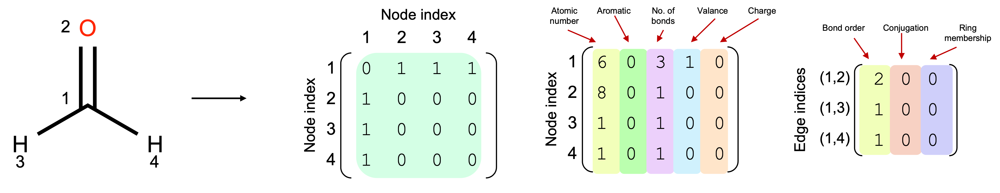
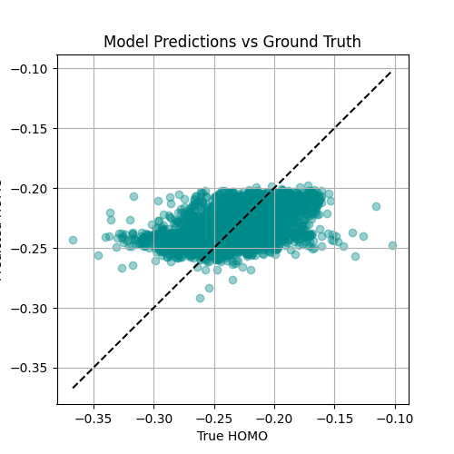
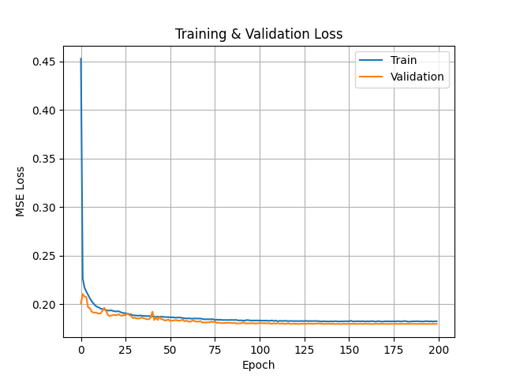

<!-- Banner Image -->
<p align="center">
  
</p>

# 🧪 Graph Neural Network for Molecular Property Prediction (QM9)

This project implements a Graph Neural Network (GNN) trained from scratch on the [QM9 dataset](https://deepchemdata.s3-us-west-1.amazonaws.com/datasets/gdb9.tar.gz) to predict quantum chemical properties — specifically the **HOMO energy** of molecules.

Molecular graphs are built from raw `.sdf` files using **RDKit** and trained using **PyTorch Geometric**. All preprocessing, training, and visualizations are implemented from scratch to maximize learning and reproducibility.

---

## 🔬 Why QM9? Why GNN?

- **QM9** provides 130,000+ small organic molecules with rich quantum properties.
- Molecules are naturally graphs — atoms as nodes, bonds as edges.
- GNNs leverage this structure, making them ideal for property prediction.

---

## 🧬 Data Pipeline

✅ Parse raw `.sdf` using RDKit  
✅ Create node, edge, and adjacency features  
✅ Build PyTorch Geometric `Data` objects  
✅ Save & load efficiently with `InMemoryDataset`

**Custom graph features:**

| Feature | Description |
|--------|-------------|
| Node features | Atomic number, aromaticity, valence, etc. |
| Edge features | Bond type, conjugation, ring status |
| Adjacency | Fully bidirectional |

---

## 🧠 Model: Graph Isomorphism Network (GIN)

We use a simple GIN-based model with:

- 3 GINConv layers
- Global mean pooling
- Fully connected layers for regression
- Dropout + ReLU activations

Target values are **z-score normalized** for training.

---

## 📈 Results

### ✅ True vs Predicted HOMO

<p align="center">
  
</p>

### ✅ Loss Curves

<p align="center">
  
</p>


## 🧾 File Structure

'''
GNN-QM9/
├── data/                # QM9 raw + processed data
├── src/                 # All code (loader, dataset, model, training)
├── notebooks/           # Jupyter visualizations
├── results/             # Predictions, losses
├── requirements.txt
└── README.md
'''

---

## 🚀 How to Run

```bash
git clone https://github.com/niayeshzrf/GNN-QM9.git
cd GNN-QM9
pip install -r requirements.txt

# Build dataset
python src/build_dataset.py

# Train model
python src/train_GNN.py
=======
# GNN-QM9
>>>>>>> 07a631be07503ca51155bf58a8bfaa9f583bf06f
